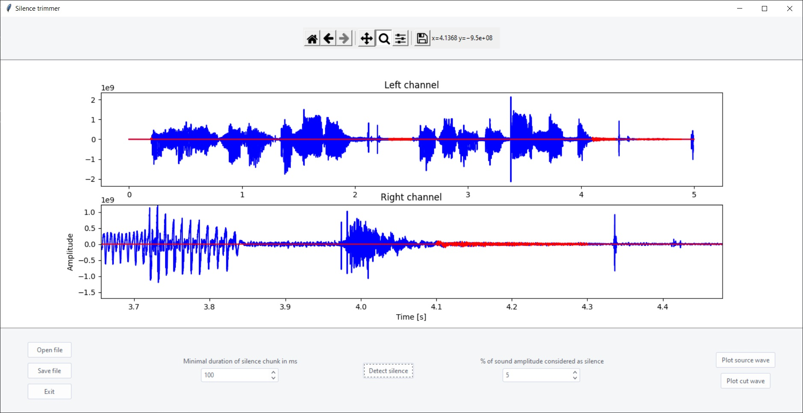

# VisTrim
###### Adjustable silence trimmer for .wav files
## Usage
1. Run `main.py` to start program. 
2. Click **Open file** button and select a file to trim.
Program should plot the sound wave, so you can see where the silence is. 
You can use a toolbar to see the plot precisely. 
3. Choose a max level of silence, which is percentage of your sound file amplitude.
4. Choose a min silence duration that will be cut.
5. **Detect silence** and **Plot silence** to make sure you chose the right value. 
6. If this choice doesn't satisfy you, **Plot source wave** and go back to 3. 
7. If plot is right, click **Cut silence** button, and you will get a trimmed sound wave. 
8. **Save file** to desired directory.
9. **Open file** again or **Exit**.
## App screenshot

